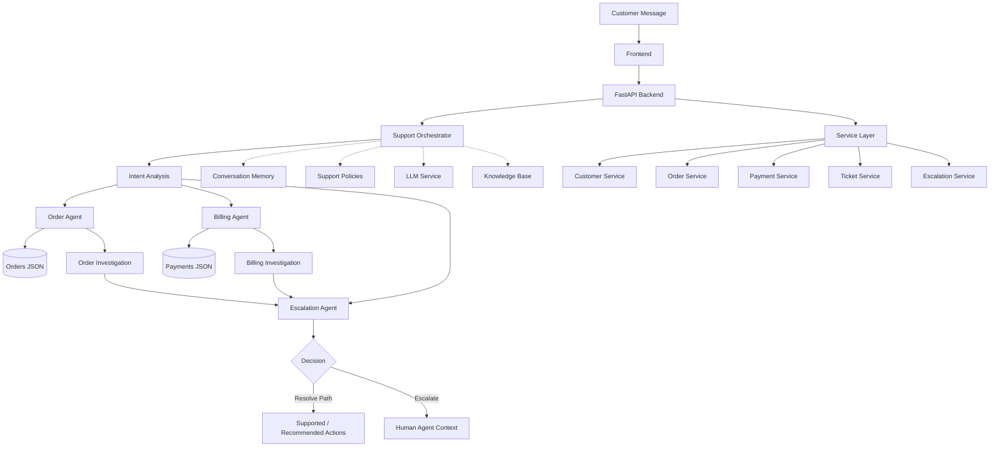
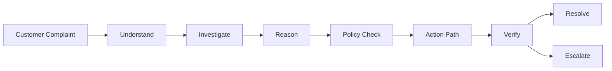

# 🛟 CURA

### *Autonomous AI Customer Support Operations & Resolution Engine*

<p align="center">


</p>

> **Cura** is an autonomous customer support prototype designed to understand customer intent, investigate issues across support data, apply safe support policies, recommend appropriate actions, maintain conversation context, and escalate complex cases to human agents with complete investigation context.

---

## 📌 Disclaimer

Cura is currently a **hackathon / educational prototype**.

The project uses synthetic demonstration data and is not connected to real customer accounts, payment systems, order-management platforms, or production CRM systems. Automated actions shown by the prototype represent supported or recommended workflows and should not be interpreted as real refunds, delivery changes, or other completed transactions.

---

## 📖 Table of Contents

- [Overview](#-project-overview)
- [Goals](#-project-goals)
- [Core Capabilities](#-core-capabilities)
- [System Architecture](#-system-architecture)
- [End-to-End Workflow](#-end-to-end-workflow)
- [Technology Stack](#-technology-stack)
- [Repository Structure](#-repository-structure)
- [Agent Architecture](#-agent-architecture)
- [Demo Scenario](#-demo-scenario)
- [API Reference](#-api-reference)
- [Installation & Setup](#-installation--setup)
- [Running the Project](#-running-the-project)
- [Testing](#-testing)
- [Development Workflow](#-development-workflow)
- [Team & Ownership](#-team--ownership)
- [Documentation](#-documentation)
- [Security & Privacy](#-security--privacy)
- [Current Limitations](#-current-limitations)
- [Future Roadmap](#-future-roadmap)
- [Acknowledgements](#-acknowledgements)
- [License](#-license)

---

# 🚀 Project Overview

Traditional customer support systems often depend on customers repeating their issue across multiple conversations while human agents manually check different systems.

Cura is designed around a different workflow:

```text
Customer Message
       ↓
Understand Intent
       ↓
Investigate Relevant Data
       ↓
Reason Over Findings
       ↓
Apply Support Policies
       ↓
Recommend / Execute Safe Action
       ↓
Verify
       ↓
Resolve OR Escalate
```

Instead of treating a support message as a simple question-and-answer interaction, Cura treats it as an **operations workflow**.

For example, a single customer message can contain multiple problems:

> "My order hasn't arrived, I was charged twice, and I already contacted support last week but nobody helped me."

Cura can break this into separate support intents, investigate the relevant records, identify the issues, and determine whether the case can follow an automated resolution path or requires human review.

---

# 🎯 Project Goals

## Primary Goals

- Understand customer support intent from natural-language messages.
- Detect multiple issues in a single customer request.
- Investigate order and payment information.
- Detect delayed orders.
- Detect potential duplicate payments.
- Apply support rules before recommending automated actions.
- Build structured escalation context for human agents.
- Provide a modular multi-agent backend architecture.
- Support a customer-facing support interface.
- Keep investigation results structured and explainable.

## Secondary Goals

The following are planned extensions of the prototype:

- Live LLM-powered response generation.
- Persistent conversation memory.
- Retrieval-augmented knowledge-base search.
- Real order-management integrations.
- Real payment/refund integrations.
- CRM/ticketing integrations.
- Authentication and role-based access.
- Production database persistence.
- Monitoring and evaluation infrastructure.

---

# 🧠 Core Capabilities

## 1. Intent Understanding

Cura analyzes the incoming customer message and identifies relevant support categories.

Current prototype intents include:

- `order`
- `billing`
- `unknown`

The current implementation uses keyword-based intent detection so that the prototype remains deterministic and easy to demonstrate.

---

## 2. Multi-Issue Detection

A customer message does not have to contain only one problem.

For example:

```text
"My order is late and I was charged twice."
```

can be classified as:

```json
{
  "intents": [
    "order",
    "billing"
  ]
}
```

This allows the orchestrator to send the relevant parts of the investigation to different specialized agents.

---

## 3. Order Investigation

The `OrderAgent` is responsible for investigating customer order information.

It can:

- Find orders belonging to a customer.
- Identify a relevant order.
- Read order status.
- Check expected delivery information.
- Detect delayed / late / processing / shipped states.
- Produce a structured investigation result.

Example:

```text
Order: ORD1001
Status: Delayed
Issue: Delivery delay detected
```

---

## 4. Billing Investigation

The `BillingAgent` investigates payment records.

It can:

- Retrieve customer payment records.
- Group payments by order and amount.
- Detect repeated matching payments.
- Identify potential duplicate charges.
- Recommend a refund workflow when a duplicate is verified.

Example:

```text
Order: ORD1001
Matching Charges: 2
Amount: 2499.00
Duplicate Charge: True
Refund Required: True
```

> The current prototype identifies and recommends the refund workflow. It does **not** connect to or execute a real payment refund.

---

## 5. Conversation Memory

Cura contains a conversation-memory module designed to store:

- Customer ID
- Message role
- Message content
- Metadata
- Timestamp
- Recent conversation history

The current implementation is in-memory and intended as a foundation for persistent conversational context.

---

## 6. Policy-Based Automation

The `SupportPolicy` module defines which actions can be handled automatically.

Example policy categories include:

| Action | Current Policy |
|---|---|
| Duplicate payment refund | Allowed when verified |
| Order delay investigation | Allowed |
| Unknown issue | Human review |

The policy layer is intended to prevent unsafe or unsupported actions.

---

## 7. Human Escalation

When Cura cannot safely resolve a case, the `EscalationAgent` creates structured context for a human support agent.

The escalation context can contain:

- Customer ID
- Original customer message
- Detected intents
- Order investigation
- Billing investigation
- Escalation reasons
- Recommended next step

This is designed to reduce the need for the customer to repeat their issue.

---

## 8. LLM Response Layer

Cura includes an `LLMService` module designed to support AI-generated customer-facing responses.

The module can construct a support prompt using:

- Customer message
- Customer context
- Investigation results
- Decision information

The current prototype contains deterministic response handling and does not require a live OpenAI API connection to run the core demonstration.

---

## 9. Knowledge Base / RAG Foundation

The project contains a knowledge-base module capable of loading:

```text
knowledge_base/
├── company_policies.md
├── product_docs.md
└── faq.md
```

The current retrieval implementation provides a lightweight keyword-based search foundation.

Full production-grade semantic retrieval is part of the planned roadmap.

---

# 🏗️ System Architecture



### Architecture Notes

The core demonstrated path currently runs through:

```text
Frontend
   ↓
FastAPI
   ↓
SupportOrchestrator
   ↓
OrderAgent / BillingAgent
   ↓
JSON Data
   ↓
EscalationAgent
   ↓
Decision
```

The memory, policy, LLM, and knowledge-base modules provide the foundation for deeper integration as development continues.

---

# 🔄 End-to-End Workflow



### Workflow Explanation

### 1. Customer Complaint

The customer submits a natural-language support request.

### 2. Understand

The orchestrator analyzes the message and detects relevant support intents.

### 3. Investigate

Specialized agents inspect the relevant support data.

### 4. Reason

The orchestrator combines investigation results.

### 5. Policy Check

The support policy determines whether an action is permitted for automated handling.

### 6. Action Path

Cura identifies the appropriate supported action or recommendation.

### 7. Verify

The system checks whether enough information exists to safely continue.

### 8. Resolve or Escalate

Cases with sufficient verified information can follow the automated resolution path.

Cases requiring additional review are escalated with structured context.

---

# 🧰 Technology Stack

| Layer | Technology |
|---|---|
| Backend | Python |
| API Framework | FastAPI |
| Data Validation | Pydantic |
| ORM / Database Foundation | SQLAlchemy |
| Frontend | React |
| Frontend Tooling | Vite |
| Demo Data | JSON |
| AI Layer | LLM service abstraction |
| Knowledge Base | Markdown |
| Testing | Pytest |
| API Server | Uvicorn |
| Configuration | Python-dotenv |

---

# 📁 Repository Structure

```text
Cura/
│
├── backend/
│   ├── README.md
│   ├── requirements.txt
│   │
│   ├── app/
│   │   ├── __init__.py
│   │   ├── main.py
│   │   ├── config.py
│   │   ├── database.py
│   │   │
│   │   ├── api/
│   │   │   ├── __init__.py
│   │   │   └── routes/
│   │   │       ├── __init__.py
│   │   │       ├── chat.py
│   │   │       ├── customers.py
│   │   │       ├── orders.py
│   │   │       ├── tickets.py
│   │   │       └── escalations.py
│   │   │
│   │   ├── agents/
│   │   │   ├── __init__.py
│   │   │   ├── orchestrator.py
│   │   │   ├── order_agent.py
│   │   │   ├── billing_agent.py
│   │   │   ├── technical_agent.py
│   │   │   ├── account_agent.py
│   │   │   └── escalation_agent.py
│   │   │
│   │   ├── core/
│   │   │   ├── __init__.py
│   │   │   ├── llm.py
│   │   │   ├── memory.py
│   │   │   ├── rag.py
│   │   │   └── policies.py
│   │   │
│   │   ├── models/
│   │   │   ├── __init__.py
│   │   │   ├── customer.py
│   │   │   ├── order.py
│   │   │   ├── payment.py
│   │   │   ├── ticket.py
│   │   │   └── escalation.py
│   │   │
│   │   ├── services/
│   │   │   ├── __init__.py
│   │   │   ├── customer_service.py
│   │   │   ├── order_service.py
│   │   │   ├── payment_service.py
│   │   │   ├── ticket_service.py
│   │   │   └── escalation_service.py
│   │   │
│   │   └── schemas/
│   │       ├── __init__.py
│   │       ├── chat.py
│   │       ├── customer.py
│   │       ├── order.py
│   │       ├── ticket.py
│   │       └── escalation.py
│   │
│   └── tests/
│       ├── __init__.py
│       ├── test_agents.py
│       └── test_api.py
│
├── frontend/
│   ├── README.md
│   ├── package.json
│   ├── .env.example
│   │
│   ├── src/
│   │   ├── main.jsx
│   │   ├── App.jsx
│   │   ├── index.css
│   │   ├── api.js
│   │   ├── components/
│   │   │   ├── Chat.jsx
│   │   │   ├── InvestigationPanel.jsx
│   │   │   ├── CustomerContext.jsx
│   │   │   ├── AgentActivity.jsx
│   │   │   ├── EscalationCard.jsx
│   │   │   └── SupportDashboard.jsx
│   │   └── pages/
│   │       ├── CustomerSupport.jsx
│   │       └── HumanAgentDashboard.jsx
│   │
│   └── public/
│
├── knowledge_base/
│   ├── README.md
│   ├── company_policies.md
│   ├── product_docs.md
│   └── faq.md
│
├── data/
│   ├── README.md
│   ├── customers.json
│   ├── orders.json
│   ├── payments.json
│   └── tickets.json
│
├── docs/
│   ├── architecture.md
│   ├── api.md
│   └── team_assignments.md
│
├── .env.example
├── .gitignore
└── README.md
```

---

# 🤖 Agent Architecture

## Support Orchestrator

**File:**

```text
backend/app/agents/orchestrator.py
```

Responsibilities:

- Analyze customer intent.
- Determine relevant agents.
- Coordinate investigations.
- Combine investigation results.
- Request a final escalation/resolution decision.

---

## Order Agent

**File:**

```text
backend/app/agents/order_agent.py
```

Responsibilities:

- Search customer orders.
- Identify relevant orders.
- Check order status.
- Detect delayed states.
- Return structured order findings.

---

## Billing Agent

**File:**

```text
backend/app/agents/billing_agent.py
```

Responsibilities:

- Search payment records.
- Group payments.
- Detect matching duplicate charges.
- Determine whether a refund workflow is required.

---

## Escalation Agent

**File:**

```text
backend/app/agents/escalation_agent.py
```

Responsibilities:

- Evaluate investigation results.
- Determine whether the request can follow the automated path.
- Identify escalation reasons.
- Build human-agent context.

---

## Core Services

```text
LLMService
ConversationMemory
SupportPolicy
KnowledgeBase
```

These modules provide the foundation for:

- AI-generated responses
- Context retention
- Safe automation
- Knowledge retrieval

---

# 🎬 Demo Scenario

Cura includes demonstration data designed around a realistic multi-issue customer support case.

### Customer

```text
Customer ID: CUST001
Customer: Rahul Sharma
```

### Order

```text
Order ID: ORD1001
Status: Delayed
```

### Payment Records

```text
PAY2001
PAY2002
```

Both payment records correspond to the same order and amount, allowing the billing agent to detect a duplicate charge.

### Previous Ticket

```text
TICK3001
Status: Closed
Priority: High
Subject: Order delivery delay
```

### Demo Customer Message

```text
My order hasn't arrived, I was charged twice, and I already contacted support last week but nobody helped me.
```

### Current Prototype Investigation

The current orchestrator identifies:

```text
Intents:
- order
- billing

Order:
- ORD1001
- Delayed

Billing:
- Duplicate charge detected
- 2 matching payment records
- Refund workflow required
```

The escalation/resolution layer then evaluates whether the available information supports the automated resolution path.

> The current orchestrator does not yet incorporate previous ticket history into its investigation decision. Ticket integration is part of the continuing development work.

---

# 🔌 API Reference

## Implemented Endpoints

### `GET /`

Returns basic API information.

Example:

```json
{
  "message": "Cura API is running",
  "version": "1.0.0"
}
```

---

### `GET /health`

Returns backend health information.

Example:

```json
{
  "status": "healthy",
  "service": "Cura"
}
```

---

## Planned / Integration Endpoints

### `POST /chat`

Intended to:

- Receive customer messages.
- Pass requests to the support orchestrator.
- Return investigation and decision information.
- Connect the frontend chat interface to the backend.

### Customer Routes

Planned routes for customer information and support context.

### Order Routes

Planned routes for order investigation.

### Ticket Routes

Planned routes for support-ticket operations.

### Escalation Routes

Planned routes for human-agent escalation management.

---

# ⚙️ Installation & Setup

## 1. Clone the Repository

```bash
git clone https://github.com/Shivanshi388/Cura.git
cd Cura
```

---

## 2. Create a Python Virtual Environment

### Windows

```powershell
python -m venv .venv
```

Activate it:

```powershell
.venv\Scripts\Activate.ps1
```

### macOS / Linux

```bash
python3 -m venv .venv
source .venv/bin/activate
```

---

## 3. Install Backend Dependencies

```bash
pip install -r backend/requirements.txt
```

---

## 4. Configure Environment Variables

Create a `.env` file from `.env.example`.

### Windows PowerShell

```powershell
Copy-Item .env.example .env
```

### macOS / Linux

```bash
cp .env.example .env
```

Example configuration:

```env
OPENAI_API_KEY=
DATABASE_URL=sqlite:///./cura.db
VITE_API_URL=http://localhost:8000
FRONTEND_URL=http://localhost:5173
```

The current core demonstration does not require a live OpenAI API key.

---

# ▶️ Running the Project

## Backend

From the project root:

```bash
uvicorn backend.app.main:app --reload
```

The API will be available at:

```text
http://localhost:8000
```

Health check:

```text
http://localhost:8000/health
```

---

## Frontend

Open a second terminal:

```bash
cd frontend
npm install
npm run dev
```

The Vite development server will provide the frontend URL in the terminal.

---

# 🧪 Testing

## Run the Test Suite

From the project root:

```bash
pytest
```

---

## Run the Core Agent Demonstration

```bash
python -c "from backend.app.agents.orchestrator import SupportOrchestrator; result=SupportOrchestrator().handle_request('CUST001', 'My order has not arrived, I was charged twice, and I already contacted support last week but nobody helped me.'); print(result)"
```

Expected investigation includes:

```text
Detected intents:
order
billing

Order investigation:
ORD1001
Delayed

Billing investigation:
Duplicate charge detected
```

The `RESOLVE` decision represents the available automated support path in the prototype. It does not mean that a real refund or delivery intervention has been executed.

---

# 🔄 Development Workflow

Recommended development cycle:

```text
1. Create / update feature
        ↓
2. Run local tests
        ↓
3. Test relevant agent or API
        ↓
4. Review changes
        ↓
5. Commit
        ↓
6. Push
        ↓
7. Integrate with team branch / main
```

Example:

```bash
git status
git add .
git commit -m "Describe the change"
git push
```

Before merging team changes, verify:

- Imports work.
- JSON data is valid.
- Tests pass.
- API starts successfully.
- Agent behavior remains consistent.
- No secrets are committed.

---

# 👥 Team & Ownership

| Team Member | Primary Area |
|---|---|
| **Shivanshi** | Backend agents, core logic, models/services/data integration |
| **Anushka** | API routes and Pydantic schemas |
| **Yovika** | Frontend and product interface integration |

---

## Shivanshi — Backend & Core Logic

Primary ownership:

```text
backend/app/agents/orchestrator.py
backend/app/agents/order_agent.py
backend/app/agents/billing_agent.py
backend/app/agents/escalation_agent.py

backend/app/core/llm.py
backend/app/core/memory.py
backend/app/core/policies.py

knowledge_base/company_policies.md
```

Additional backend foundation:

```text
backend/app/main.py
backend/app/config.py
backend/app/database.py

backend/app/models/
backend/app/services/

data/
backend/requirements.txt
.env.example
```

---

## Anushka — API & Schemas

Primary ownership:

```text
backend/app/api/
backend/app/api/routes/chat.py

backend/app/schemas/
```

Focus:

- API contracts
- Request / response schemas
- Chat endpoint integration
- Backend-to-frontend communication

---

## Yovika — Frontend

Frontend project area:

```text
frontend/
```

Key interface components include:

```text
Chat
InvestigationPanel
CustomerContext
AgentActivity
EscalationCard
SupportDashboard
```

---

# 📚 Documentation

Project documentation is organized into:

```text
docs/
├── architecture.md
├── api.md
└── team_assignments.md
```

Additional documentation is available within:

```text
backend/README.md
frontend/README.md
knowledge_base/README.md
data/README.md
```

---

# 🔐 Security & Privacy

Cura is currently a prototype and should not be connected to real customer information without additional security controls.

Important principles:

- Do not commit API keys.
- Keep secrets inside `.env`.
- Use synthetic data during development.
- Validate incoming API data.
- Add authentication before production deployment.
- Add authorization before allowing sensitive support actions.
- Log actions safely without exposing sensitive customer information.
- Require appropriate verification before financial operations.

---

# ⚠️ Current Limitations

### Data

Current investigations use local JSON demonstration data.

### Intent Classification

The current orchestrator uses keyword-based intent detection rather than a production-grade language model classifier.

### Payments

Duplicate payments can be detected from demonstration records, but no real refund is executed.

### Orders

Delayed-order investigation is demonstrated using local order records. No real logistics system is connected.

### Conversation Memory

The memory module currently stores information in process memory and is not a persistent production database.

### LLM Integration

The LLM service abstraction exists, but the current core workflow does not require a live LLM API call.

### RAG

The knowledge-base module currently provides lightweight retrieval rather than production semantic search.

### Ticket Context

Ticket data exists in the project, but the current orchestrator does not yet use ticket history as part of its main investigation flow.

### Authentication

Production authentication and authorization are not yet implemented.

### Production Integrations

Cura is not currently connected to:

- Payment gateways
- E-commerce platforms
- Shipping providers
- CRM systems
- Production ticketing platforms

---

# 🛣️ Future Roadmap

## Phase 1 — Core Integration

- [ ] Complete `/chat` API integration.
- [ ] Connect frontend chat to backend.
- [ ] Connect investigation results to UI.
- [ ] Complete human-agent escalation display.

## Phase 2 — Intelligence

- [ ] Integrate LLM-based intent classification.
- [ ] Improve multi-intent reasoning.
- [ ] Integrate conversation memory.
- [ ] Connect knowledge-base retrieval.
- [ ] Improve response generation.

## Phase 3 — Action Layer

- [ ] Implement structured action tools.
- [ ] Add action verification.
- [ ] Add action audit logs.
- [ ] Connect safe automated workflows.

## Phase 4 — Data & Integrations

- [ ] Move from JSON to persistent database storage.
- [ ] Connect real order systems.
- [ ] Connect payment systems.
- [ ] Connect CRM / ticketing systems.
- [ ] Add customer authentication.

## Phase 5 — Production Readiness

- [ ] Role-based access control.
- [ ] Monitoring and observability.
- [ ] Error tracking.
- [ ] Evaluation datasets.
- [ ] Automated agent testing.
- [ ] CI/CD pipeline.
- [ ] Cloud deployment.

---

# 💡 Design Philosophy

Cura is built around five principles:

### Understand

Do not treat every customer message as a simple FAQ.

### Investigate

Use available records before producing an answer.

### Reason

Combine evidence from multiple support domains.

### Act Safely

Only recommend or execute actions supported by available evidence and policy.

### Escalate with Context

When automation is insufficient, give the human agent the information needed to continue the case without starting from zero.

---

# 🌱 Why Cura?

Customer support is not only about answering questions.

A useful support system needs to:

```text
Understand
    ↓
Investigate
    ↓
Reason
    ↓
Act
    ↓
Verify
    ↓
Remember
    ↓
Escalate when necessary
```

Cura is designed as a foundation for that operational support model.

---

# 🙌 Acknowledgements

Cura is built using open-source technologies and frameworks including:

- FastAPI
- React
- Vite
- SQLAlchemy
- Pydantic
- Uvicorn
- Pytest

The project was developed as a customer-support automation prototype for a hackathon challenge focused on autonomous AI customer support operations.

---

# 📄 License

This repository is intended for **educational and hackathon demonstration purposes**.

Before using Cura in a production environment, additional work is required around:

- Security
- Authentication
- Authorization
- Data privacy
- Auditability
- Reliability
- Production integrations
- Financial-action safeguards

---

# 📬 Repository

GitHub:

**https://github.com/Shivanshi388/Cura**

---

<p align="center">

### Built with Python, FastAPI, React, and a focus on autonomous customer support operations.

**Cura — Understand. Investigate. Act. Escalate.**

</p>
